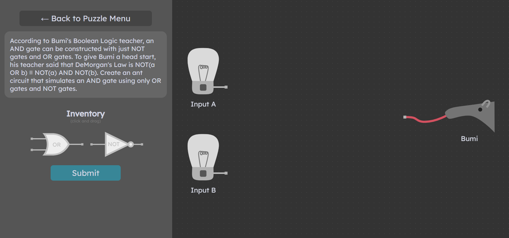
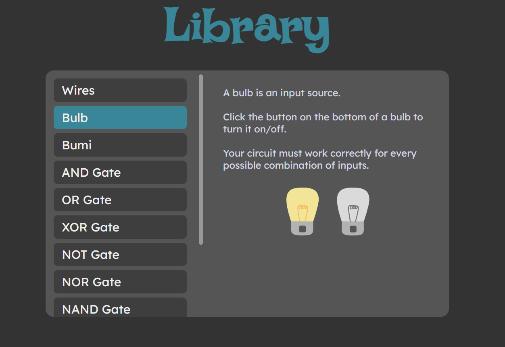

# AntLogic

Project currently hosted at [https://ant-logic.thebenjicat.dev](https://ant-logic.thebenjicat.dev)

AntLogic is an interactive logic gate simulator for the purposes of education. 
AntLogic was made as a part of IrvineHacks 2024 with the following team members (GitHub's linked):
- [Yousef Khan](https://github.com/YKAwesome)
- [Jackson Podgorski](https://github.com/podskio)
- [Benjamin Cates](https://github.com/benjamin-cates)

 
## Images

Bumi learns DeMorgan's Law:


Library page to teach boolean logic concepts:


## Functionality
In the level screen, there are lightbulbs on the left that represent the inputs. On the right is Bumi the anteater, who is the output. The goal of each level is to design a circuit whose output pattern exactly matches the description. 

An example puzzle is:
```
Bumi is learning about a new kind of gate in his computer science class.
This gate is called XOR and turns on if either the first input is on or
the second input is on, but not if both are on. However, it seems that
you don’t have this gate anywhere in your zookeeper shed. Build an ant
circuit that is equivalent to this, but with different gates, so we can
teach Bumi how it works!
```

Gates:
- AND gate
- NOT gate
- XOR gate
- NAND gate
- NOR gate

The main pages of AntLogic are:
- Leaderboard shows the top ranking players for each puzzle
- Library shows guides on how each of the components work
- Puzzles shows a list of puzzles
- Login and signup page allow users to make an account to be on the leaderboard

## Building locally
The backend is build using Actix Web in Rust. Running it requires the Rust toolchain, which can be installed at [https://rustup.rs](https://rustup.rs). After that, `cd` into the `backend` directory and run `cargo run` from the terminal.

NOTE: The frontend by default references `ant-logic-api.thebenjicat.dev`, so make sure you change the `API_ROOT` in `frontend/src/utils/backend.ts`.

NOTE: The backend requires an API key to a valid Firebase project. This is stored in `backend/src/api_key.txt`. 

The frontend is hosted with Vite, which is an npm package. Ensure you have Node installed and the Node Package Manager (npm). `cd` into the `frontend` directory and run `npm install` to install all of the required packages. Then run `npm run dev` to host the frontend.
